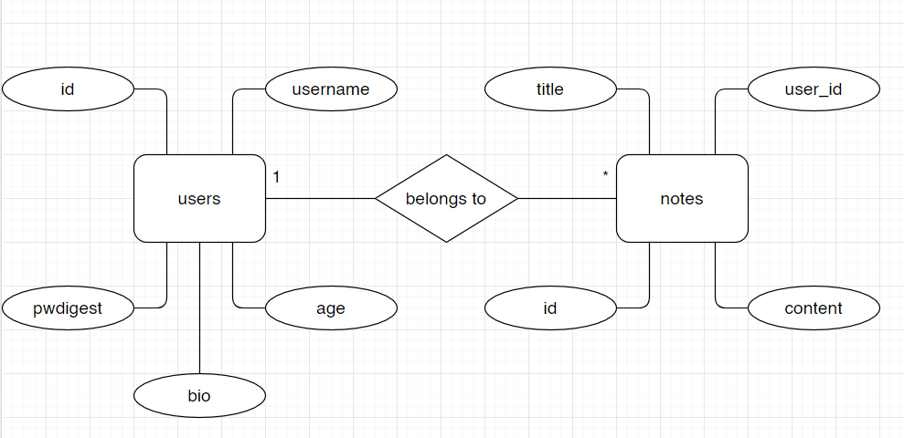

# Projektplan

## 1. Projektbeskrivning

Jag bygger en hemsida där användare kan skapa anteckningar. 

Användare ska kunna registrera konton på hemsidan, vilket ger dem möjlighet att skriva anteckningar. De ska även kunna ta bort sina anteckningar, ändra sitt användarnamn, samt lägga till och ta bort användarinformation.  

## 2. Vyer

## 3. Databas med ER-diagram

## 4. Arkitektur (Beskriv filer och mappar - vad gör/innehåller de?).

Notes-mapp: Innehåller new.slim och show.slim. 
I notes/new.slim finns formulär för att skapa nya notes. 
notes/show.slim visar en användares alla notes. 

Users-mapp: Innehåller edit.slim, index.slim och new.slim. 
users/edit.slim innehåller formulär för att ändra användarnamn samt lägga till och ändra information om användarens ålder och biografi. 
users/index.slim är landingsidan. Där hälsas användaren välkommen, ålder och biografi visas (om informationen är tillagd) och uppgiftsinstruktionerna visas. 
users/new.slim 

Errors-mapp: Innehåller not_loggedin.slim, password_empty.slim, user_not_unique.slim, wrongpw.slim och note_empty.slim.
errors/not_loggedin.slim visas om en icke-inloggad besökare försöker visa en sida som kräver inloggning. 
errors/password_empty.slim visas om någon försöker registrera ett konto utan att skriva in lösenord eller användarnamn.
errors/user_not_unique visas om någon försöker registrera ett konto med ett användarnamn som är upptaget. 
errors/wrongpw.slim visas om fel lösenord skrivs in vid inloggning. 
errors/note_empty.slim visas om du försöker skapa en note utan att skriva in något.

I dokumentation.slim finns dokumentation för projektet. 
I index.slim hälsas besökare välkomna innan de har loggat in. 
Layout.slim innehåller hemsidans layout. Där finns metadata och headerlayout. 
login.slim är sidan från vilken du loggar in. Här finns även en länk till users/new.slim

