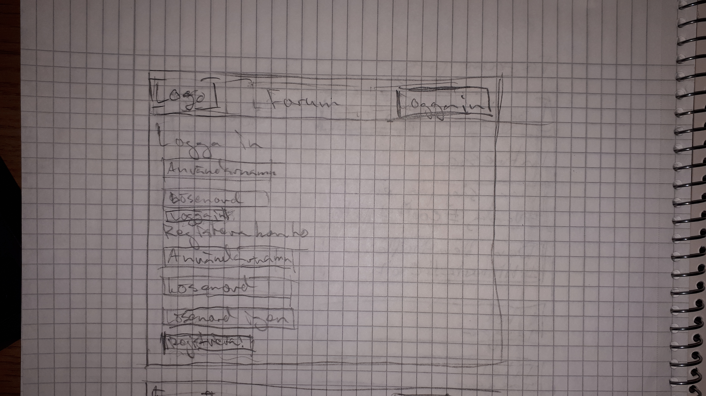
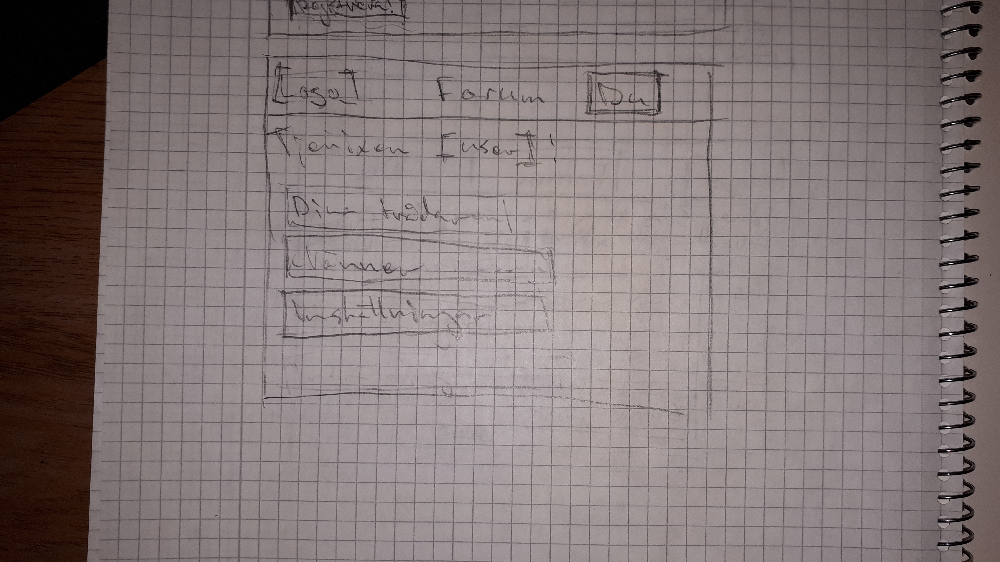
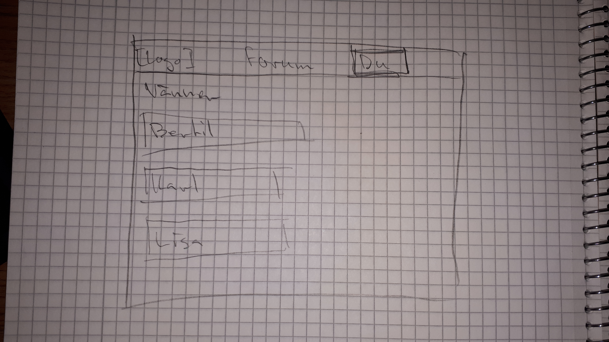
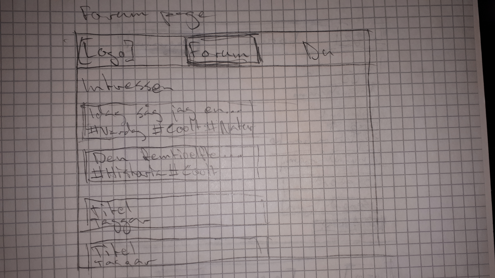
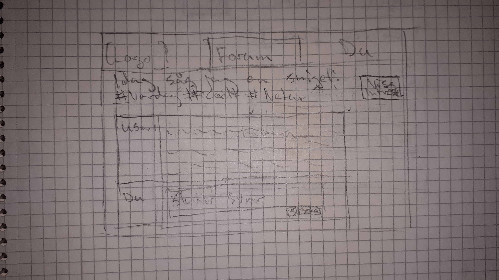
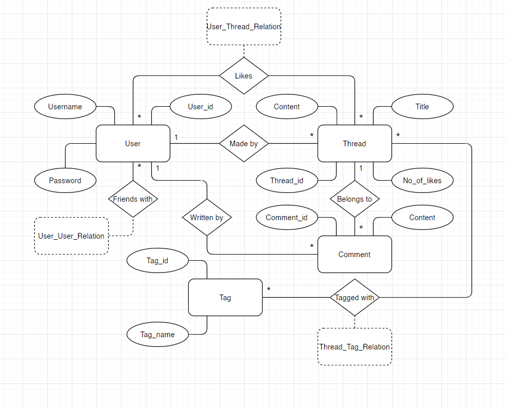

# Projektplan

## 1. Projektbeskrivning

Jag bygger en hemsida där individer kan dela citat. 

Användare ska kunna registrera konton på hemsidan, vilket ger dem möjlighet att lägga upp posts innehållande citat med en namn på vem de citerarsom andra användare sedan kan gilla. 

## 2. Vyer

## 3. Databas med ER-diagram

## 4. Arkitektur (Beskriv filer och mappar - vad gör/innehåller de?).

